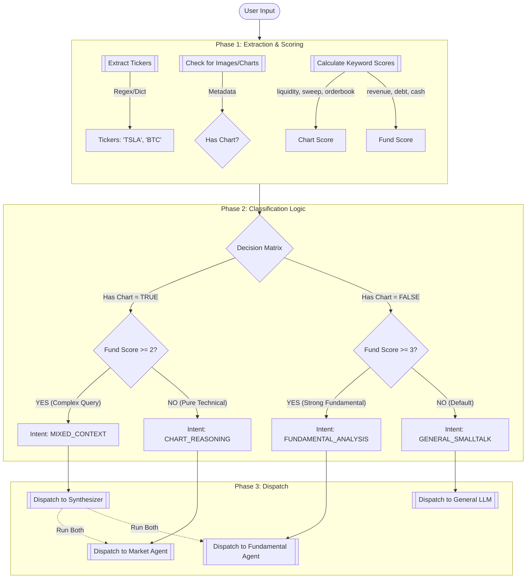

# Intent Router: Deep-Dive Logic & Visualization

## 1. Core Logic Overview
The **Intent Router** is the deterministic brain of the system. It does not just "guess"; it uses a weighted scoring system to classify requests into one of four buckets.

**The 4 Intents**:
1.  `CHART_REASONING`: "Look at this chart." (Visual + Technical)
2.  `FUNDAMENTAL_ANALYSIS`: "How is the balance sheet?" (Text + Financials)
3.  `MIXED_CONTEXT`: "Chart looks good, but is it profitable?" (Visual + Financials)
4.  `GENERAL_SMALLTALK`: "Hi", "Who are you?" (Conversational)

---

## 2. The Decision Flow (Mermaid Diagram)



---

## 3. Detailed Logic Breakdown

### A. Entity Extraction
*   **Tickers**: We use a regex `\b[A-Z]{1,5}\b` validated against a `MarketDataService` dictionary.
*   **Assets**: We map "Bitcoin" -> `BTC`, "Tesla" -> `TSLA`.

### B. Scoring System (The "Weights")
We count keywords to determine the "flavor" of the text.

**Chart Keywords (+1 Point each)**:
> `liquidity`, `stop hunt`, `sweep`, `orderbook`, `setup`, `support`, `resistance`, `trend`, `breakout`, `rsi`, `macd`

**Fundamental Keywords (+1 Point each)**:
> `earnings`, `revenue`, `profit`, `margin`, `cash flow`, `debt`, `valuation`, `guidance`, `10-k`, `10-q`, `sec`

### C. The Decision Matrix (The Rules)

| Condition | Logic | Resulting Intent | Explanation |
| :--- | :--- | :--- | :--- |
| **Chart Present** | `HasChart=True` AND `FundScore < 2` | `CHART_REASONING` | User uploaded a chart and didn't ask deep financial questions. |
| **Mixed Context** | `HasChart=True` AND `FundScore >= 2` | `MIXED_CONTEXT` | User uploaded a chart BUT also asked about "earnings" or "debt". Needs both agents. |
| **Fundamental** | `HasChart=False` AND `FundScore >= 3` | `FUNDAMENTAL_ANALYSIS` | No chart, but strong financial keywords detected. |
| **General** | `HasChart=False` AND `FundScore < 3` | `GENERAL_SMALLTALK` | Ambiguous or conversational. |

---

## 4. Data Model (The Output)

The Router outputs this normalized object to the agents:

```python
@dataclass
class IntentObject:
    intent: str          # The classification result
    tickers: list[str]   # ['TSLA']
    has_chart: bool      # True/False
    text: str            # Normalized user prompt
    scores: dict         # {'chart': 5, 'fund': 0} (for debugging)
```
