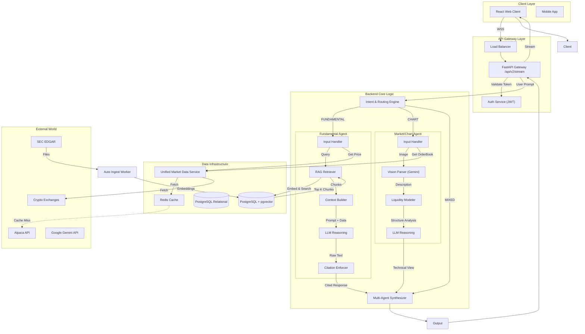

# TradeBerg V2: Deep-Dive Technical Specification

## 1. Executive Summary
TradeBerg V2 is a **Multi-Agent Market Reasoning System**. Unlike a standard chatbot that routes a prompt to a single LLM, TradeBerg V2 treats every user request as a "Research Project." It dispatches specialized agents to gather evidence (filings, charts, prices), synthesize a thesis, and present it with strict citation discipline.

---

## 2. System Topology (Deep Dive)

---

## 3. Component Deep Dive

### A. The Intent & Routing Engine
**File**: `backend/core/intent_router.py`
*   **Input**: User Prompt + Attachments (Images).
*   **Logic**:
    1.  **Vision Check**: If image present -> `CHART_REASONING_QUERY` (unless text explicitly asks for fundamentals).
    2.  **Keyword Analysis**: Scans for "earnings", "revenue", "debt" -> `FUNDAMENTAL_QUERY`.
    3.  **Complexity Check**: If prompt asks "Does the chart support the valuation?" -> `MIXED_CONTEXT`.
*   **Output**: Dispatches the request to the appropriate Agent(s).

### B. The Fundamental Agent (The "Researcher")
**File**: `backend/core/agents/fundamental_agent.py`
This agent is a pipeline, not just a prompt.
1.  **RAG Retriever**:
    *   Takes the user query (e.g., "Tesla margins").
    *   Generates an embedding vector.
    *   Queries `pgvector` for the top 10 most relevant chunks from 10-K/10-Q filings.
    *   **Crucial**: It retrieves *metadata* (Page Number, Table Name) along with the text.
2.  **Context Builder**:
    *   Combines the User Prompt + Retrieved Chunks + Live Price Data (from `UnifiedMarketData`).
3.  **LLM Reasoning**:
    *   System Prompt enforces: "You are a financial analyst. You must cite every claim."
4.  **Citation Enforcer**:
    *   Post-processes the LLM output. Checks if `[Source: ...]` tags exist. If not, it flags the response as "Low Confidence."

### C. The Market / Chart Agent (The "Trader")
**File**: `backend/core/agents/market_agent.py`
This agent "sees" the market.
1.  **Vision Parser**:
    *   Sends the chart image to Gemini Vision Pro.
    *   Prompt: "Identify the asset, timeframe, and key price levels."
2.  **Liquidity Modeler**:
    *   Analyzes the vision output for "Liquidity Grabs" (wicks below support) and "Fair Value Gaps" (imbalance).
3.  **Order Book Overlay**:
    *   Fetches the live Order Book (Bids/Asks) from `UnifiedMarketData`.
    *   Checks if there is a "Buy Wall" at the support level identified in the chart.
4.  **Synthesis**:
    *   Combines the Visual Pattern + Order Book Data into a trade setup thesis.

### D. The Multi-Agent Synthesizer (The "Editor")
**File**: `backend/core/synthesizer.py`
*   **Role**: When `MIXED_CONTEXT` is triggered, this component receives two outputs:
    1.  Fundamental: "Bearish. Margins are compressing."
    2.  Technical: "Bullish. Double bottom breakout."
*   **Logic**: It uses a "Meta-Prompt" to resolve the conflict.
    *   *Example Output*: "Short-term Bullish, Long-term Bearish. The chart suggests a bounce to $200, but fundamental headwinds make this a selling opportunity rather than a long-term investment."

### E. Unified Market Data Service
**File**: `backend/services/market_data_service.py`
*   **Problem**: Crypto APIs (CCXT) and Stock APIs (Google Search Grounding) look completely different.
*   **Solution**: A Middleware Layer that normalizes everything into a single `MarketAsset` object.
    *   `get_price("BTC")` -> Calls Binance -> Returns `{price: 65000, vol: ...}`
    *   `get_price("AAPL")` -> Calls Alpaca -> Returns `{price: 180, vol: ...}`
*   **Caching**: Uses Redis (or in-memory dictionary for MVP) to prevent hitting API rate limits.

---

## 4. Data Flow Example: "Is Tesla a buy right now?"

1.  **Gateway** receives request.
2.  **Router** sees "buy" + "Tesla" -> Classifies as `MIXED_CONTEXT` (requires both price action and value check).
3.  **Parallel Execution**:
    *   **Fundamental Agent**: Pulls TSLA 10-K. Sees declining margins. Verdict: **Neutral/Bearish**.
    *   **Chart Agent**: Pulls TSLA price history. Sees RSI < 30 (Oversold). Verdict: **Bullish Bounce**.
4.  **Synthesizer**:
    *   Reads both verdicts.
    *   Constructs Final Answer: "Tesla presents a **contrarian setup**. While fundamentals are weakening due to margin compression [Source: Q3 10-Q], the stock is technically oversold (RSI 28) and at major support. Aggressive traders may look for a bounce, but long-term investors should wait for margin stabilization."
5.  **Gateway** streams this text to the user.
