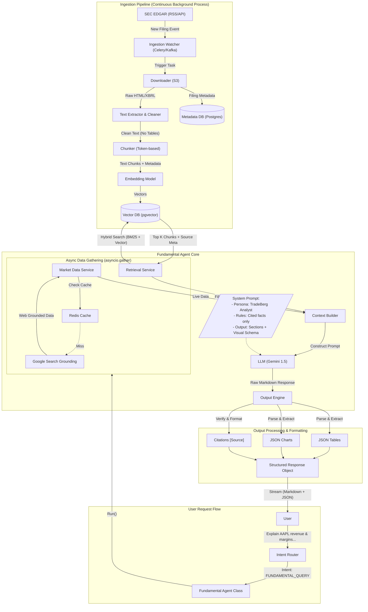

# Fundamental Agent Architecture: End-to-End Visualization

## Overview
This diagram captures the complete lifecycle of the **Fundamental Agent**, from the continuous ingestion of SEC filings to the generation of structured, cited financial analysis.

## Architecture Diagram

## Key Components Explained

### 1. Ingestion Pipeline
*   **Watcher**: Polls SEC RSS feeds every few minutes.
*   **Extractor**: Strips HTML tags, identifies sections (MD&A, Risk Factors), and cleans text.
*   **Vector DB**: Stores embeddings with rich metadata (`ticker`, `form`, `filed_at`, `section`).

### 2. Agent Core
*   **Parallel Execution**: Fetches RAG data and Live Market data simultaneously for speed.
*   **Context Builder**: Merges "Past" (Filings) with "Present" (Live Price) into a single prompt.
*   **System Prompt**: Enforces the "TradeBerg Analyst" persona—concise, factual, and strictly cited.

### 3. Output Engine
*   **Role**: The "Formatter". It takes the raw text from the LLM and converts it into a structured format the frontend can render.
*   **Features**:
    *   Detects tables in text -> Converts to React-ready JSON.
    *   Detects time-series data -> Converts to Chart.js/Recharts JSON.
    *   Validates citations against the retrieved chunks.
